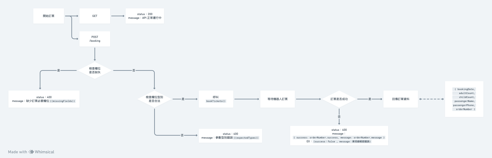

# 東琉線訂票 API 介接說明

## 介接說明

    API 使用 express 進行開發，共有 2 支 API，分別為健康度檢測用（GET）、東琉線訂票用（POST）。

## 健康度檢測用 API

    健康度檢測用 API 用於檢測 API 是否正常運作，並回傳當前時間。

### GET `/`

#### 請求範例（API_URL 需更換為實際部署 URL）

```bash
curl -X GET "http://localhost:3030/" -H "Identity: identity_value"

```

## 東琉線訂票用 API (Booking API)

    此 API 用於訂購東琉線的船票，並且回傳所有訂票資料（含訂單編號）。

### POST `/booking`

#### 請求參數：

request header 需包含 `Identity` 欄位，其值為 `klook`。

request body 需為 JSON 格式，包含以下欄位：

- `klookOrderNumber`: 字串，Klook 訂票編號。
- `bookingDate`: 字串，訂票日期。
- `adultCount`: 數字，全票數量。
- `childCount`: 數字，半票數量。
- `passengerName`: 字串，乘客姓名。
- `passengerPhone`: 字串，乘客聯絡電話。

#### 請求範例（API_URL 需更換為實際部署 URL）

```bash
curl -X POST "http://localhost:3030/booking" \
     -H "Content-Type: application/json" \
     -H "Identity: flyfish" \
     -d '{
         "klookOrderNumber": "KLK123456",
         "bookingDate": "2023-12-01",
         "adultCount": 2,
         "childCount": 1,
         "passengerName": "測試用",
         "passengerPhone": "0900000000"
     }'
```

#### 可能的錯誤回應：

- `400`：缺少訂票必要欄位。
- `400`：參數型別錯誤。
- `400`：東琉線帳密錯誤。（訂票機器人問題）
- `400`：日期輸入框未找到。（訂票機器人問題）
- `400`：票種輸入框未找到。（訂票機器人問題）
- `400`：乘客姓名輸入框未找到。（訂票機器人問題）
- `400`：乘客聯絡電話輸入框未找到。（訂票機器人問題）
- `400`：確定訂購按鈕未找到。（訂票機器人問題）
- `401`：Identity 欄位錯誤。

## 訂票機器人運作流程圖


